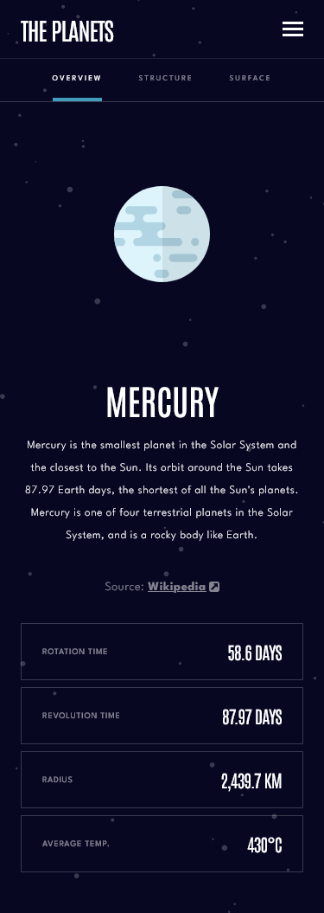
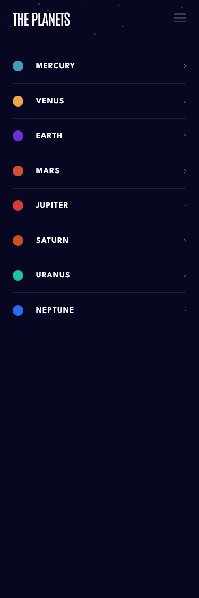
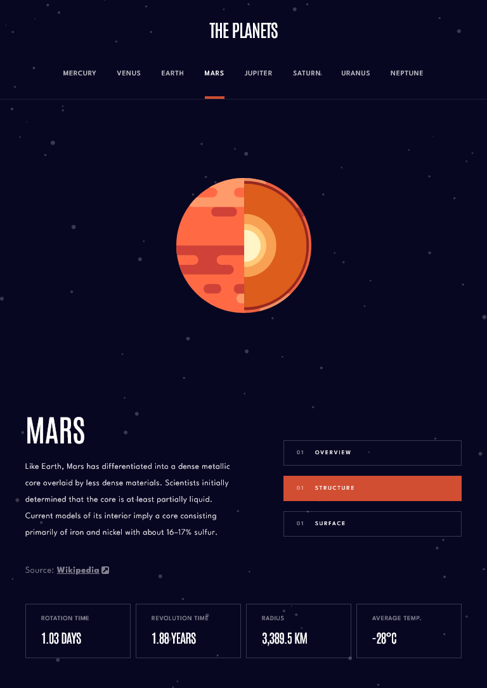
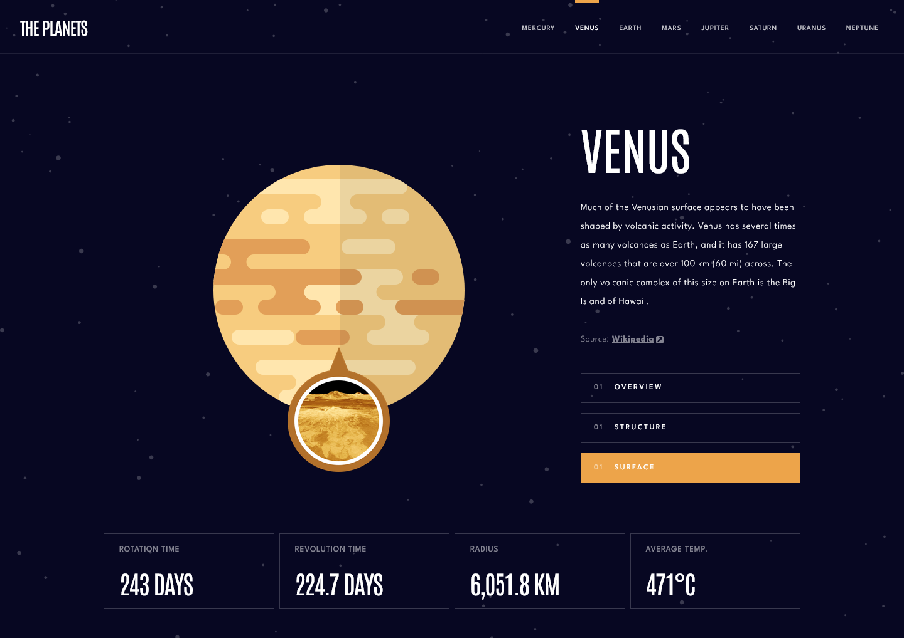

# Frontend Mentor - Planets fact site solution

This is a solution to the [Planets fact site challenge on Frontend Mentor](https://www.frontendmentor.io/challenges/planets-fact-site-gazqN8w_f). Frontend Mentor challenges help you improve your coding skills by building realistic projects.

## Table of contents

- [Overview](#overview)
  - [The challenge](#the-challenge)
  - [Screenshot](#screenshot)
  - [Links](#links)
- [My process](#my-process)
  - [Built with](#built-with)
  - [What I learned](#what-i-learned)
  - [Continued development](#continued-development)
  - [Useful resources](#useful-resources)
- [Author](#author)
- [Acknowledgments](#acknowledgments)

## Overview

### The challenge

Users should be able to:

- View the optimal layout for the app depending on their device's screen size
- See hover states for all interactive elements on the page
- View each planet page and toggle between "Overview", "Internal Structure", and "Surface Geology"

### Screenshot

### Links

- Solution URL: [Solution URL here](https://your-solution-url.com)
- Live Site URL: [Live site URL here](https://cla91-planets-fact-site.netlify.app/)

## My process

### Built with

- Semantic HTML5 markup
- CSS custom properties
- Flexbox
- CSS Grid
- Mobile-first workflow
- [React](https://reactjs.org/) - JS library
- [SASS](https://sass-lang.com/) - SASS
- [React Router] (https://reactrouter.com/) - For client-side routing and dynamic URL parameters
- [React Transition Group] (https://reactcommunity.org/react-transition-group/css-transition) - To manage transitions for the mobile menu

### What I learned

This project was an excellent opportunity to reinforce my skills in building a multi-page, responsive React application. I specifically focused on:

- React Context API: I used the Context API to manage the state of the planets' data globally, making it accessible to multiple components like Planet and Navbar without prop drilling.
- React Router: I learned how to set up dynamic routes (/:planetName) to handle different planet pages and how to use the useParams hook to read the URL parameters.
- Rules of Hooks: I encountered and debugged a critical error related to the Rules of Hooks. The original code had a conditional return statement that caused hooks like useEffect to be skipped, leading to a breakdown in the component's state management. Resolving this by placing all hook calls at the top of the component file was a key learning moment.
- Responsive Design with Hooks: I practiced using the useState and useEffect hooks to dynamically handle the display of the mobile navigation menu based on media query changes, which is a great pattern for responsive React components.
- Component Reusability: I created reusable components like NavbarLink to generate navigation links dynamically, which makes the code more scalable and easier to maintain.

### Continued development

I want to continue improving my skills in the following areas for future projects:

- State Management Libraries: While the Context API was sufficient for this project, I'd like to explore and implement more complex state management with libraries like Redux Toolkit or Zustand to see how they handle larger-scale applications.
- Performance Optimization: I'm interested in using React's memo and useCallback hooks more effectively to optimize rendering performance, especially for larger component trees.
- Accessibility: I want to put more focus on implementing robust ARIA attributes and keyboard navigation to ensure that my projects are accessible to all users.

### Useful resources

- [React router doc](https://reactrouter.com/en/main) - This was essential for setting up the dynamic routing and understanding how to use useParams.
- [React dev docs: rules of hooks](https://react.dev/link/rules-of-hooks) - The official documentation was crucial for understanding and fixing the bug related to conditional hook calls.
- [Sass doc](https://sass-lang.com/documentation) - The official Sass documentation was my go-to for referencing syntax and advanced features.

## Author

- Website - [Claudia Cantiani](https://cla91.github.io/)
- Frontend Mentor - [@cla91](https://www.frontendmentor.io/profile/cla91)
- Github - [@cla91](https://github.com/cla91)

## Acknowledgments

A special thanks to the Frontend Mentor community for providing such a well-defined challenge that helped me learn and grow as a developer.
